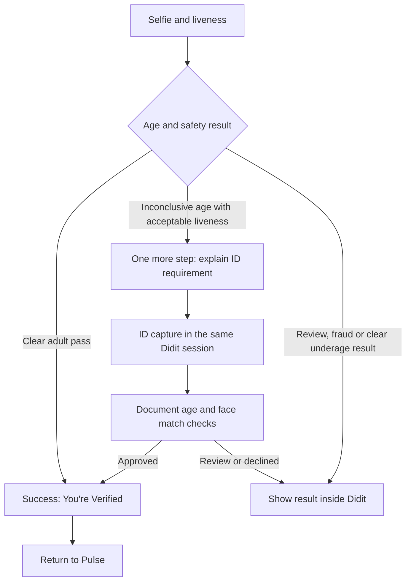

# Didit age verification decision tree

User-approved flow, 2026-09-13. **Pending configuration in Didit; not ready for a retest.**

All age-estimation and documentary fallback steps belong in **one hosted Didit session**. An inconclusive selfie must not return to Pulse to start another session. Only a successful final verification should trigger the automatic return to Pulse. Users must still be able to cancel or close the browser; that does not grant verification.

## Messages and routing

| Result | Message | Next action |
| --- | --- | --- |
| Selfie age verified | **You’re Verified**. Your age was verified with a selfie. | Success return to Pulse; no ID step. |
| Age inconclusive | **One more step**. We couldn’t confirm your age with a selfie. Continue with ID to finish verification. | **Continue with ID**, inside the same Didit session. |
| ID verified | **You’re Verified**. | Success return to Pulse. |
| Needs review | **Verification needs review**. | Remain in Didit’s review result; no new verification CTA or automatic success return. |
| Final decline | **Verification not approved**. | Remain in Didit’s result; no verified access. |

Keep the existing age policy: clear selfie pass above 25 with accepted liveness and no unresolved warnings; documentary evidence for the 15–25 buffer or missing age estimate where liveness is acceptable; documentary minimum 18. Unknown warnings, fraud and review decisions must not be treated as a simple age-estimation fallback. Pulse continues to fetch and validate provider evidence independently.

## Configuration still required

1. Use the initial sandbox workflow under stable ID `64fe50ae-dff0-484d-9786-c95a0652ea1b` in Didit's Advanced workflow editor. Preserve document-country settings and the separate optional ID-upgrade workflow.
2. Read the editor's available age/liveness branch fields and operators. Build explicit success, eligible ID fallback, and decline/review routes with an explicit else branch. Do not invent field paths or publish an unvalidated graph.
3. Confirm the supported hosted explanation/message step or customization for the ID transition. A branching edge alone is not proof that the requested message appears.
4. Configure and test return behavior: success returns to Pulse; an inconclusive selfie continues to ID within Didit. Ensure both steps use the same session ID and that face matching can use its captured selfie.
5. Test clear selfie success, inconclusive selfie → ID, final decline/review, cancellation and return on a phone. Verify Pulse's server status and lack of access for unverified results.

The connected application API key supports the simple linear workflow REST interface. Graph editing uses authenticated user-scoped console/MCP access; no Didit MCP connection is configured here. Exact branch field IDs, message-step support and success-only return controls remain unverified. See [workflow graph documentation](https://docs.didit.me/management-api/workflows/create#branching--node-based-workflows-graph) and [Didit MCP authentication](https://docs.didit.me/integration/mcp/authentication).

## Rollback completed

The separate Pulse fallback prompt and `/continue-id` endpoints were removed. The previous multi-step sandbox workflow was restored as published version `ba82f505-ab85-4db8-a016-b447283e29d4` instead of the selfie-only workaround. This restores the earlier baseline, not a proven decision tree. Success copy, review-state controls and the optional ID upgrade remain. The additive fallback migration/private fields remain for historical evidence; legacy split-session records cannot start another selfie to bypass their required ID evidence.

## MCP connection checkpoint

The Didit hosted server (`https://mcp.didit.me/mcp`) was added to the workspace's Codex MCP configuration. OAuth login is **not complete**. Default login generates a loopback callback on this remote workspace. A login attempt using the development HTTPS callback was rejected by Didit with `invalid_redirect_uri`: remote HTTPS redirects require operator registration unless they exactly match a trusted cloud callback. No authorization grant was completed and no credentials were obtained.

Finish login through the user's supported local MCP client or a trusted cloud connector, or have Didit register the remote callback for this client. Do not treat configuration as authentication, forward authorization codes through chat, or attempt to bypass the redirect restriction. The user is being asked which client hosts this conversation to select the correct supported route. The decision tree remains pending until authenticated tools are available.
