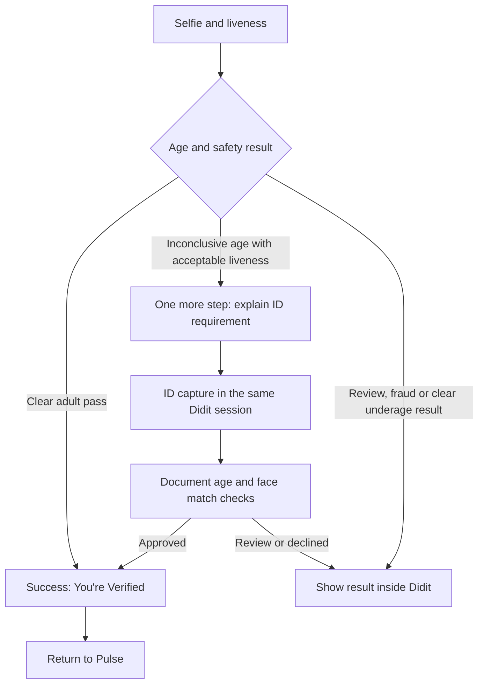

# Didit age verification decision tree

User-approved flow, updated 2026-09-14. **The running development API is currently back on sandbox. The live connection was temporary; persistent live settings still need to be saved before the planned live test. Real capture and hosted return behavior remain untested.**

## One API key setting — 2026-09-14

User decision: use the existing `DIDIT_API_KEY` for the selected environment. The separate `DIDIT_LIVE_API_KEY` was redundant when the workflow IDs, environment and webhook secret also need to change together. Pulse no longer reads the separate key. The current sandbox configuration is retained; switching to live is a separate coordinated settings update before testing.

For that switch, replace `DIDIT_API_KEY` with the live application's key (the value previously saved as `DIDIT_LIVE_API_KEY`), update the environment, both workflow IDs and live webhook signing secret together, then restart and verify the running API. Remove the redundant `DIDIT_LIVE_API_KEY` from server secrets after its value is saved under `DIDIT_API_KEY`. The code change does not edit the host's saved secrets.

Validation: API typecheck, build and the existing HTTP/database verification integration tests passed. Those tests use mocked Didit responses and confirm that both environments read only `DIDIT_API_KEY`, including when an obsolete live-key setting is present. The development API was restarted as PID 4116 with its entire existing environment preserved (`sandbox`). The rebuilt bundle has no reference to `DIDIT_LIVE_API_KEY`. The running verification page returned 200; authenticated website status returned 200 with `environment: sandbox`; unauthenticated status returned 401. The temporary browser session was removed and the designated test account's verification record was unchanged. No provider session or real capture was started.

## Paused — resume testing on 2026-09-15

**Configuration recheck after the pause:** Both the current tool environment and the running API (PID 385) report `DIDIT_ENVIRONMENT=sandbox`; neither configured workflow ID matches the prepared live workflows. `DIDIT_LIVE_API_KEY` is present. The running webhook secret matches the tool environment, but its live provenance was not revalidated. The earlier live process has been replaced, consistent with a restart restoring the saved sandbox settings. No configuration was changed during this recheck. Save the complete live settings below, restart and verify the running API before any real capture. Testing remains postponed.

Saved on 2026-09-14 at the user's request: “save here we will test tomorrow.” The implementation and connection checks below are complete; real verification testing is postponed. No additional provider changes or account resets are needed for this pause.

Resume with these steps:

1. Confirm the saved server settings and the actual running API both select live Didit with the workflow IDs and signing secret recorded below. The latest tool environment still contains the old environment/workflow settings, although `DIDIT_LIVE_API_KEY` is present. The latest recheck confirmed the running API is back on sandbox; rediscover its process after any restart rather than relying on a historical PID.
2. Confirm prepaid credit in Didit Billing. The last checked balance was zero; no real capture or paid check has been completed.
3. Test with `e2ebrands@gmail.com` (UID 33737). Its live record is already prepared and unverified; inspect its current state before considering any reset. Open Account → Age verification, accept the notice and tap Verify now.
4. Check the actual selfie outcome, any ID fallback within the same hosted session, result wording, return to Pulse and resulting Selfie/ID status. Record observed behavior; configuration checks do not establish that these steps work on a phone.

Keep the existing development domain. The configuration recheck above defines the current runtime state; the live connection details below describe the prepared setup and required settings. Older checkpoints are historical.

All age-estimation and documentary fallback steps belong in **one hosted Didit session**. An inconclusive selfie must not return to Pulse to start another session. Only a successful final verification should trigger the automatic return to Pulse. Users must still be able to cancel or close the browser; that does not grant verification.




## Running live connection — 2026-09-14

Historical connection checkpoint: the user added `DIDIT_LIVE_API_KEY`, and that key successfully read the live application's workflows and received HTTP 403 for the known sandbox session. At that time Pulse selected the extra key in live mode. This selection rule has since been removed at the user's request; both environments now use only `DIDIT_API_KEY`.

| Setting used for the temporary live connection | Value |
| --- | --- |
| Environment | `live` |
| Initial workflow | `86aee2d8-2562-4286-99c7-52f333f6d827` — Pulse Adaptive 18+ live verification, published version 1 |
| ID-upgrade workflow | `98f54ad5-61dc-48e4-a056-b0a23549aeae` — existing published Pulse 18+ verification |
| Live webhook | `ffecc06d-4646-42f0-8594-5682d350808f` — Pulse development age verification, enabled for `status.updated` and `data.updated`, V3 |
| Website/API host | Existing development preview; unchanged |

The initial workflow uses AGE_ESTIMATION → OCR → FACE_MATCH → IP_ANALYSIS → Determine, with passive liveness, minimum 18, enabled ID fallback and the 15–25 buffer. It was created through Didit's documented feature configuration API with the previously approved settings and no custom branch graph or forced Approved result. Its saved age, country and feature settings were re-read and compared before publication. The existing live ID workflow's OCR configuration matches the sandbox ID-upgrade configuration, so that published live workflow was reused without modification. Hosted selfie success and conditional fallback are still assumptions to validate through actual capture.

Automatic approval review initially rejected publication because hosted behavior was unverified. After the draft settings were independently checked, the provider's built-in fallback documentation was confirmed, and the server's verification regression tests passed, a renewed request explicitly scoped to publishing the unused workflow was approved. Publication succeeded. This did not establish a completed biometric test.

The development API was rebuilt and restarted as PID 3173 on port 8080, preserving its existing environment except for the explicit live Didit settings. Actual running-server checks passed:

- Public personal verification page: HTTP 200.
- Unsigned webhook request: HTTP 401.
- No-op webhook request signed with the live destination's secret: HTTP 200. This was an integration connectivity check, not a Didit-delivered verification result.
- Temporary authenticated website session for UID 33737: HTTP 200, `environment: live`, `status: not_started`, `isVerified: false`, Mature Content off. The temporary session was removed.
- API typecheck, build and verification HTTP/database regression tests passed. The regression tests mocked Didit and covered live/sandbox key selection, age evidence, ID upgrade, review, stale callbacks and environment isolation.

The designated tester remains `e2ebrands@gmail.com`, UID 33737. Its empty, unverified sandbox record was backed up privately to `.local/verification-backups/2026-09-14-33737-92c5e102-98e8-431b-a397-40963dcc490c.json`, then changed to a fresh live reference with no verification granted. Existing website sessions for this tester were invalidated. The already verified sandbox account UID 61079 was not modified and is not considered live verified.

### Required persistent settings

These values were used for the temporary live connection. The current running API is back on sandbox; save these values in the host's server settings before restarting for the live test:

```text
DIDIT_ENVIRONMENT=live
DIDIT_WORKFLOW_ID=86aee2d8-2562-4286-99c7-52f333f6d827
DIDIT_ID_WORKFLOW_ID=98f54ad5-61dc-48e4-a056-b0a23549aeae
```

Also replace `DIDIT_WEBHOOK_SECRET` in server secrets with the signing secret from the **live** application's webhook **Pulse development age verification** (`ffecc06d-4646-42f0-8594-5682d350808f`). Find it in Didit → live application → API & Webhooks. Replace `DIDIT_API_KEY` with the live application's key when saving all these live settings together. The live key was previously saved under `DIDIT_LIVE_API_KEY`; copy its value within the server secrets manager, then remove that redundant setting. Pulse only reads `DIDIT_API_KEY`. Do not put key values or the webhook secret in this document or chat. A restart with the old saved settings will revert the provider environment to sandbox.

### Real verification test pending

Didit's live balance was rechecked and remains `$0.0000`, with auto-refill disabled. Age estimation is a paid feature; the user has been asked to add prepaid credit directly in Didit Billing. No top-up, real selfie, ID submission or paid check was performed by this connection work. See [Didit's free-plan explanation](https://help.didit.me/getting-started/free-plan).

Once credit is available, the user should open Pulse as `e2ebrands@gmail.com`, go to Account → Age verification, accept the notice and tap Verify now. Inspect the resulting live session's outcome/check types and verify the actual phone return. Do not mark the verification rollout ready for launch merely because connection checks passed. Hosted transition wording and success-only return remain unverified.

## Live connection authorized — 2026-09-14

The user instructed: “lets assume and connect the live.” Proceed with Didit's standard Adaptive Age Verification setup and a real verification test; do not require another sandbox investigation or another approval merely to connect live. This changes the provider environment, not the development website/domain or the previously approved one-session user experience. The sandbox explanation remains an assumption until real capture establishes the behavior.

Current checks:

- The installed `DIDIT_API_KEY` can read the known sandbox session, whose response explicitly reports `environment: sandbox`. Both configured workflow IDs belong to that sandbox application. No live key or authenticated Didit MCP tools are available in this workspace.
- The user has been asked to stage the live application's key in server secrets as `DIDIT_LIVE_API_KEY`. This is a provisioning input only: current application code still reads `DIDIT_API_KEY`, so adding the staging secret alone does not switch the app.
- The public personal verification page returns HTTP 200. An unsigned POST to the existing webhook route returns HTTP 401. These checks used the current configuration and do not prove delivery from the live Didit application.

Connection steps once the live key is available:

1. Verify access to the live application and inspect its existing workflows. Use the official Adaptive template: minimum 18, 15–25 fallback buffer, liveness and document/face-match evidence compatible with Pulse's checks. Keep the separate mandatory-ID upgrade available. Preserve the agreed country coverage; Russia alone must not block progress. Do not replace the standard template with another unproven custom branch graph.
2. Configure the live webhook destination for `status.updated` and `data.updated` at `https://254cd483-13a8-46a7-aec3-b50e106f5db3-00-29qgy6snub3n8.kirk.replit.dev/api/verification/webhook`. Use that live application's signing secret. Keep the personal page at `https://254cd483-13a8-46a7-aec3-b50e106f5db3-00-29qgy6snub3n8.kirk.replit.dev/api/verification/` and the existing app return path.
3. Install the live key, initial workflow ID, ID-upgrade workflow ID and signing secret as the active settings, then set `DIDIT_ENVIRONMENT=live` together. Persist the settings, preserve unrelated runtime configuration, rebuild/restart the development API if necessary and verify the running endpoints and signed callback.
4. Prepare a fresh live verification for the designated tester. Current code hides sandbox verification in live mode, but an existing sandbox identity row will reject a new start with HTTP 409 because there is one row per user. Preserve its sandbox evidence and arrange a clean live record or use a fresh account; do not relabel sandbox approval as live approval.
5. Complete actual consenting-user capture, inspect only the necessary outcome/evidence, and confirm success return plus correct Selfie/ID status. Record the hosted fallback explanation and decline/review behavior actually observed. A configuration check alone is not a completed verification test.

No provider workflow, secret, account verification state or API code was changed during this initial live-access check. Actual live connection remains pending the live key; do not report it connected yet.

## Sandbox behavior check — latest checkpoint

The user asked to simplify the investigation and establish whether sandbox behavior explains the repeated ID step. This checkpoint supersedes the earlier draft/version state below; it does not change the approved one-session flow or acceptance requirements.

Read-only provider checks on 2026-09-13 found:

- The existing approved sandbox session `ff1a312b-66e0-4523-b388-25efe667e2cf` used scenario `approve`, returned an Approved liveness check with no numeric age estimate, and included one ID verification. This is actual provider response evidence, but the underlying checks were simulated. It did not exercise a proven clear-adult selfie-only pass.
- `GET /v1/sandbox/scenarios/` returned 29 scenarios. None offered a specific simulated selfie age or an explicit clear-adult age-estimation success case. Document-age scenarios and age-related terminal risk simulations exist; those do not establish a supported way to supply the numeric selfie estimate used during routing.
- The existing simple workflow `d4f01d5d-1547-43fd-9964-25ca614ee94b`, labelled Adaptive Age Estimation, has type `adaptive_age_verification`, minimum 18, fallback enabled and a 15–25 buffer. It exposes no custom node graph. This provides an account-local reference for the documented Adaptive template; its hosted behavior was not tested here.
- The account now lists published Pulse version 8, `ffa94683-f85f-4726-9d30-823294e806c4`, under the existing stable workflow ID. Its AGE_ESTIMATION settings also specify minimum 18 and enabled 15–25 fallback. The graph is AGE_ESTIMATION → OCR → FACE_MATCH → IP_ANALYSIS → Determine. Versions 6 and 7 now show the same linear structure and published status; the earlier version-6 draft report is historical. This workspace did not make those provider changes.

Didit's [sandbox documentation](https://docs.didit.me/integration/sandbox-testing) says captured media does not determine sandbox results, and scenario inputs pass through the workflow pipeline. It does not establish that sandbox always runs every step. A missing simulated age is a plausible explanation for ID fallback, not proof of the cause or of live behavior. Likewise, a linear graph with fallback enabled is not by itself proof that the built-in Adaptive behavior is broken.

Next, establish the supported test for the official [Adaptive Age Verification template](https://docs.didit.me/console/workflows): **In sandbox, which scenario or supported setting returns a clear-adult numeric selfie estimate so the session finishes without ID? Does the standard approve scenario return a null age and therefore continue to ID?** Use the provider console or ask Didit support if this cannot be established through the available API. Do not create further custom branches solely to compensate for missing sandbox evidence. The requested hosted explanation and success-only return remain to be verified.

No application code, user verification state, provider session or workflow was changed in this check.

## Messages and routing

| Result | Message | Next action |
| --- | --- | --- |
| Selfie age verified | **You’re Verified**. Your age was verified with a selfie. | Success return to Pulse; no ID step. |
| Age inconclusive | **One more step**. We couldn’t confirm your age with a selfie. Continue with ID to finish verification. | **Continue with ID**, inside the same Didit session. |
| ID verified | **You’re Verified**. | Success return to Pulse. |
| Needs review | **Verification needs review**. | Remain in Didit’s review result; no new verification CTA or automatic success return. |
| Final decline | **Verification not approved**. | Remain in Didit’s result; no verified access. |

Keep the existing age policy: clear selfie pass above 25 with accepted liveness and no unresolved warnings; documentary evidence for the 15–25 buffer or missing age estimate where liveness is acceptable; documentary minimum 18. Unknown warnings, fraud and review decisions must not be treated as a simple age-estimation fallback. Pulse continues to fetch and validate provider evidence independently.

## Configuration still required

1. Use the initial sandbox workflow under stable ID `64fe50ae-dff0-484d-9786-c95a0652ea1b` in Didit's Advanced workflow editor. Preserve document-country settings and the separate optional ID-upgrade workflow.
2. Read the editor's available age/liveness branch fields and operators. Build explicit success, eligible ID fallback, and decline/review routes with an explicit else branch. Do not invent field paths or publish an unvalidated graph.
3. Confirm the supported hosted explanation/message step or customization for the ID transition. A branching edge alone is not proof that the requested message appears.
4. Configure and test return behavior: success returns to Pulse; an inconclusive selfie continues to ID within Didit. Ensure both steps use the same session ID and that face matching can use its captured selfie.
5. Test clear selfie success, inconclusive selfie → ID, final decline/review, cancellation and return on a phone. Verify Pulse's server status and lack of access for unverified results.

The connected application API key supports the simple linear workflow REST interface. Graph editing uses authenticated user-scoped console/MCP access; this workspace has no authenticated Didit MCP connection. The user has connected from Codex on another PC. Exact supported safety branches, message-step support and success-only return controls remain unresolved. See [workflow graph documentation](https://docs.didit.me/management-api/workflows/create#branching--node-based-workflows-graph) and [Didit MCP authentication](https://docs.didit.me/integration/mcp/authentication).

## Rollback completed

The separate Pulse fallback prompt and `/continue-id` endpoints were removed. The previous multi-step sandbox workflow was restored as published version `ba82f505-ab85-4db8-a016-b447283e29d4` instead of the selfie-only workaround. This restores the earlier baseline, not a proven decision tree. Success copy, review-state controls and the optional ID upgrade remain. The additive fallback migration/private fields remain for historical evidence; legacy split-session records cannot start another selfie to bypass their required ID evidence.


## MCP connection checkpoint

The Didit hosted server (`https://mcp.didit.me/mcp`) was added to the workspace's Codex MCP configuration. OAuth login is **not complete**. Default login generates a loopback callback on this remote workspace. A login attempt using the development HTTPS callback was rejected by Didit with `invalid_redirect_uri`: remote HTTPS redirects require operator registration unless they exactly match a trusted cloud callback. No authorization grant was completed and no credentials were obtained.

Finish login through the user's supported local MCP client or a trusted cloud connector, or have Didit register the remote callback for this client. Do not treat configuration as authentication, forward authorization codes through chat, or attempt to bypass the redirect restriction. The user is being asked which client hosts this conversation to select the correct supported route. The decision tree remains pending until authenticated tools are available.


## Handoff to the user's authenticated Codex

The user connected Didit MCP from Codex on another PC. That session should configure and validate the hosted decision tree using the existing stable sandbox workflow, following the specification above. This workspace still has no authenticated MCP connection. Request a summary of the resulting workflow/version IDs, graph branches, hosted messages, return behavior, tests and any remaining unsupported controls; no secrets or identity data need to be transferred between the sessions.


## Sandbox draft checkpoint — 2026-09-13

The other Codex retained validated draft `0fc7b7ae-bb58-4e5e-bebd-30eb69b4dd72` (version 6), without publishing. Published version `ba82f505-ab85-4db8-a016-b447283e29d4` (version 5) remains the baseline under stable workflow `64fe50ae-dff0-484d-9786-c95a0652ea1b`. This workspace independently read the draft graph through the sandbox application API and confirmed its routes:

| Condition | Draft route |
| --- | --- |
| Present estimated age below 15 | Declined |
| All other estimates, including above 25 or missing age | Existing ID capture and face match in the same graph |
| Declined document or face match, or document age below 18 | Declined |
| Approved document, present adult DOB/age, approved face match | Existing IP analysis, then Determine |
| Remaining documentary outcomes | In Review |

**Clear adult selfie success is still missing. This draft does not implement the approved flow and must not be presented as ready for a user retest.** Its fallback also does not establish the required distinction between inconclusive age and unacceptable liveness or warnings.

The other Codex reports that graph validation rejects `liveness.status` after AGE_ESTIMATION without a separate LIVENESS feature, and available branch fields omit selfie warnings. It also reports that branding reads expose `copy_overrides: {}` and `completion_display_mode: "decision"`, but the connected update tool cannot write those controls. The public [branding API schema](https://docs.didit.me/openapi-25.json), independently inspected here, likewise does not document these properties in its update payload. `callback_seconds` specifies delay, not a proven success-only return policy. No requested hosted copy was configured; the existing callback destinations and three-second delay remain unchanged according to the handoff.

The handoff reports graph validation and ten local synthetic routing checks, not Didit session simulations or hosted-screen/device tests. Clear selfie success failed its required routing check. Cancellation, captured-selfie reuse, review/decline screens and success-only return remain unverified. The handoff reports document-country settings, webhooks, the published graph and the separate ID-upgrade workflow unchanged; this workspace made no provider changes during this review.

### Next bounded investigation

Didit's [workflow documentation](https://docs.didit.me/management-api/workflows/create) describes Determine as deciding from the outcomes of features that actually ran. Its [feature configuration documentation](https://docs.didit.me/management-api/workflows/feature-configs) also exposes AGE_ESTIMATION liveness thresholds and risk actions. These suggest a possible clear-adult route through IP analysis to Determine without referencing `liveness.status` directly in a branch. **This is an unproven candidate, not an accepted implementation.**

Ask the authenticated Codex to inspect whether those documented controls can enforce every existing selfie acceptance requirement and keep fraud/review outcomes out of the ordinary ID fallback. Use the retained draft only; never force an Approved terminal status or weaken Pulse's independent evidence checks. Prove how low liveness, warnings, missing age, review and decline affect the final result, and distinguish actual provider evidence from local routing tests. A separate LIVENESS step is not an approved extra capture unless Didit confirms the existing selfie can be reused and the resulting experience meets the agreed flow.

Separately establish the supported console setting or provider-supported mechanism for the in-session **One more step** explanation and success-only automatic return. If those controls are unavailable through MCP, report the exact console actions or questions for Didit support. Do not invent branding fields, substitute Pulse screens or publish this incomplete draft.
